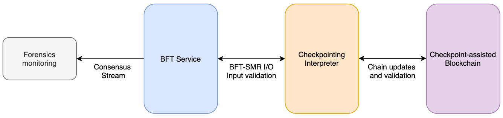
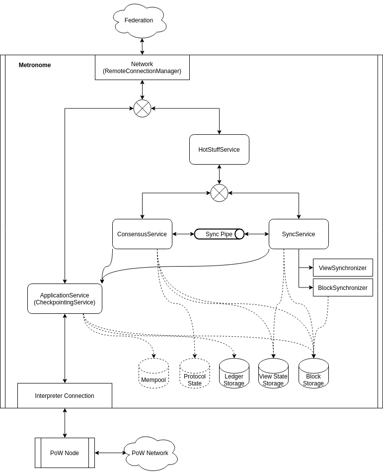
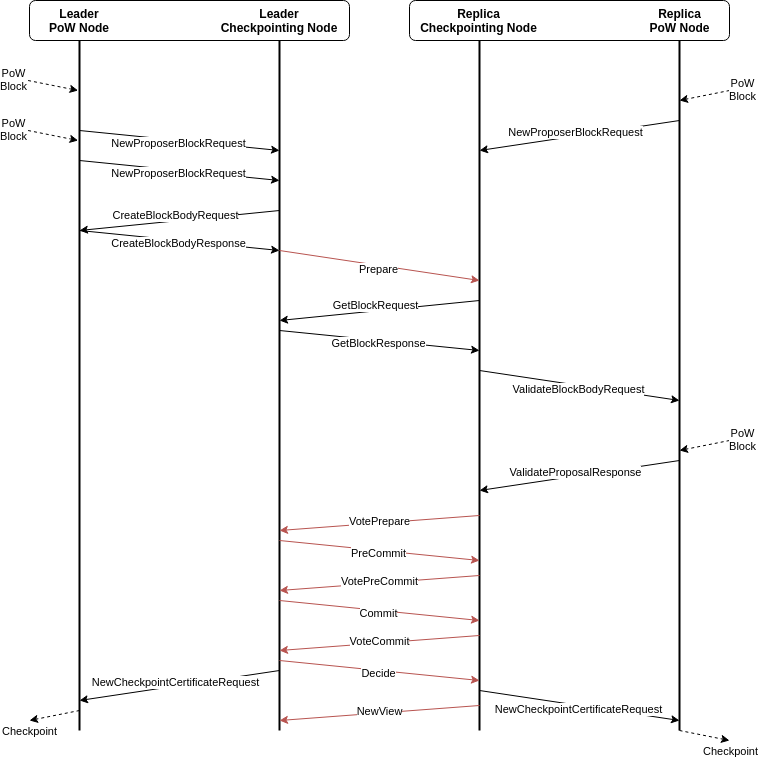

# Metronome

Metronome is a checkpointing component for Proof-of-Work blockchains, using the [HotStuff BFT](https://arxiv.org/pdf/1803.05069.pdf) algorithm.

## Overview
Checkpointing provides finality to blockchains by attesting to the hash of well-embedded blocks. A proper checkpointing system can secure the blockchain even against an adversary with super-majority mining power.

The Metronome checkpointing system consists of a generic BFT Service (preferably HotStuff), a Checkpoint-assisted Blockchain, and a Checkpointing Interpreter that bridges the two. This structure enables many features, including flexible BFT choices, multi-chain support, plug-and-play forensic monitoring platform via the BFT service, and the capability of bridging trust between two different blockchains.

### Architecture

BFT Service: A committee-based BFT service with a simple and generic interface. It takes consensus candidates (e.g., checkpoint candidates) as input and generates certificates for the elected ones.

Checkpoint-assisted Blockchain: Maintains the main blockchain that accepts and applies checkpointing results. The checkpointing logic is delegated to the checkpointing interpreter below.

Checkpointing Interpreter: Maintains checkpointing logic, including the creation and validation (via blockchain) of checkpointing candidates, as well as checkpoint-related validation of new blockchain blocks.

Each of these modules can be developed independently with only minor data structure changes required for compatibility. This independence allows flexibility with the choice of BFT algorithm (e.g., variants of OBFT or Hotstuff) and checkpointing interpreter (e.g., simple checkpoints or Advocate).

The architecture also enables a convenient forensic monitoring module. By simply connecting to the BFT service, the forensics module can download the stream of consensus data and detect illegal behaviors such as collusion, and identify the offenders.





### BFT Algorithm

The BFT service delegates checkpoint proposal and candidate validation to the Checkpointing Interpreter using 2-way communication to allow asynchronous responses as and when the data becomes available.



When a winner is elected, a Checkpoint Certificate is compiled, comprising the checkpointed data (a block identity, or something more complex) and a witness for the BFT agreement, which proves that the decision is final and cannot be rolled back. Because of the need for this proof, low latency BFT algorithms such as HotStuff are preferred.

## Build

### Requirements

- Mill, a build tool for scala.
- JDK 11

### Building the project

The project is built using [Mill](https://github.com/com-lihaoyi/mill), which works fine with [Metals](https://scalameta.org/metals/docs/build-tools/mill.html).

To compile everything, use the `__` wildcard:

```console
mill __.compile
```

The project is set up to cross build to all Scala versions for downstream projects that need to import the libraries. To build any specific version, put them in square brackets:

```console
mill metronome[2.12.10].checkpointing.app.compile
```

To run tests, use the wild cards again and the `.test` postix:

```console
mill __.test
mill --watch metronome[2.13.4].rocksdb.props.test
```

To run a single test class, use the `.single` method with the full path to the spec. Note that `ScalaTest` tests are in the `specs` subdirectories while `ScalaCheck` ones are in `props`.

```console
mill __.storage.specs.single io.iohk.metronome.storage.KVStoreStateSpec
mill __.hotstuff.consensus.props.single io.iohk.metronome.hotstuff.consensus.basic.ProtocolStateProps
```

To experiment with the code, start an interactive session:

```console
mill -i metronome[2.13.4].hotstuff.consensus.console
```

### Versions

You will need Java 11 to build.

The `mill` version is set in the `.mill-version` file or the `MILL_VERSION` env var. To build with Nix in sandbox environment, it's best to make sure that the build works with the version that Nix comes with, because after [this update](https://github.com/NixOS/nixpkgs/pull/130823) it's not going to dynamically download the one set in the project.

### Formatting the codebase

Please configure your editor to use `scalafmt` on save. CI will be configured to check formatting.


## Publishing

We're using the [VersionFile](https://com-lihaoyi.github.io/mill/page/contrib-modules.html#version-file) plugin to manage versions.

The initial version has been written to the file without newlines:
```console
echo -n "0.1.0-SNAPSHOT" > versionFile/version
```

Builds on `develop` will publish the snapshot version to Sonatype, which can be overwritten if the version number is not updated.

During [publishing](https://com-lihaoyi.github.io/mill/page/common-project-layouts.html#publishing) on `master` we will use `mill versionFile.setReleaseVersion` to remove the `-SNAPSHOT` postfix and make a release. After that the version number should be bumped on `develop`, e.g. `mill versionFile.setNextVersion --bump minor`.

## Example Applications

The [examples](./metronome/examples) module contains applications that demonstrate the software at work with simplified consensus use cases.

### Robot

The [robot example](./metronome/examples/src/io/iohk/metronome/examples/robot) is about the federation moving around a fictional robot on the screen.
Each leader proposes the next command to be carried out by the robot, once consensus is reached. The setup assumes 4 nodes, with at most
1 Byzantine member.

To test it, start 4 consoles and run commands like the following, `$i` going from 0 to 3:

```shell
./metronome/examples/robot.sh $i
```

The detailed logs should be in `~/.metronome/examples/robot/logs/node-$i.log`, e.g.:

```console
$ tail -f ~/.metronome/examples/robot/logs/node-0.log
14:03:03.607 ERROR i.i.m.h.s.tracing.ConsensusEvent Error {"message":"Error processing effect SendMessage(ECPublicKey(ByteVector(64 bytes, 0xcb020251d396614a35038dd2ff88fd2f1a5fd74c8bcad4b353fa605405c8b1b8c80ee12d2a10b1fca59424b16890c8115fbc94a68026369acc3c2603595e6387)),NewView(5,QuorumCertificate(Prepare,0,ByteVector(32 bytes, 0xb978b34fc4e905a727065b3e18d941a44a8349d8251514debbee5d6ddb94d430),GroupSignature(List()))))","error":"Connection with node ECPublicKey(ByteVector(64 bytes, 0xcb020251d396614a35038dd2ff88fd2f1a5fd74c8bcad4b353fa605405c8b1b8c80ee12d2a10b1fca59424b16890c8115fbc94a68026369acc3c2603595e6387)), has already closed"}
14:03:04.736 DEBUG i.i.m.networking.NetworkEvent ConnectionFailed {"key":"23fcab42e8f1078880b27aab4849092489bfa8d3e3b0faa54c9db89e89223c783ec7a3b2f8e6461b27778f78cea261a2272abe31c5601173b2964ef14af897dc","address":"localhost/127.0.0.1:40003","error":"io.iohk.scalanet.peergroup.PeerGroup$ChannelSetupException: Error establishing channel to PeerInfo(BitVector(512 bits, 0x23fcab42e8f1078880b27aab4849092489bfa8d3e3b0faa54c9db89e89223c783ec7a3b2f8e6461b27778f78cea261a2272abe31c5601173b2964ef14af897dc),localhost/127.0.0.1:40003)."}
```

To clear out everything before a restart, just run `rm -rf ~/.metronome/examples/robot`.


## Running the Checkpointing Service

First generate some ECDSA keys to be used by the federation, as well as one to be
used by the PoW interpreter (it has to be different from the key used by the service):

```console
$ mill metronome[2.13.4].checkpointing.app.run keygen > service-keys.json
[424/424] metronome[2.13.4].checkpointing.app.run
$ cat service-keys.json
{
  "publicKey" : "ab5944b35a12f87133b5cf525b7a2ecc698a059b4d46898c4f58970e73069aeebeb55765ade41d781120c27ef8a88ae1cb2ff5c2e70345373b524dcfcb6636d5",
  "privateKey" : "057b39a793c06683b4ebec95456f576be4c44e4404e126f0a46689d259209a75"
}
$ mill metronome[2.13.4].checkpointing.app.run keygen > interpreter-keys.json
[424/424] metronome[2.13.4].checkpointing.app.run
```

The results can be parsed for example with [jq](https://stedolan.github.io/jq/), as seen in the example below.

Create a config file to provide the necessary settings which the default `application.conf` doesn't have. For example:

```shell
cat <<EOF >example.conf
include "/application.conf"

metronome {
  checkpointing {
    federation {
      self {
        host = $(dig +short myip.opendns.com @resolver4.opendns.com)
        port = 40000
        private-key = $(jq -r ".privateKey" service-keys.json)
      }

      # Append here other the other nodes you create.
      others = [
      ]
    }
    local {
      interpreter {
        public-key = $(jq -r ".publicKey" interpreter-keys.json)
      }
    }
  }
}
EOF
```

Build the service into a fat JAR so we can pass system properties when we run it:

```shell
SCALA_VER=2.13.4
ASSEMBLY_JAR=${PWD}/out/metronome/${SCALA_VER}/checkpointing/app/assembly/dest/out.jar
mill metoronme[$SCALA_VER].checkpointing.app.assembly
```

Start the service by pointing it at the example configuration:

```console
$ java -cp $ASSEMBLY_JAR -Dconfig.file=example.conf io.iohk.metronome.checkpointing.app.CheckpointingApp service
13:22:02.853 WARN  i.i.m.h.s.tracing.ConsensusEvent Timeout {"viewNumber":7,"messageCounter":{"past":0,"present":0,"future":0}}
13:22:02.895 WARN  i.i.m.c.s.tracing.CheckpointingEvent InterpreterUnavailable {"messageType":"CreateBlockBodyRequest"}
```

Detailed logs should appear in `~/.metronome/checkpointing/logs/service.log`.
